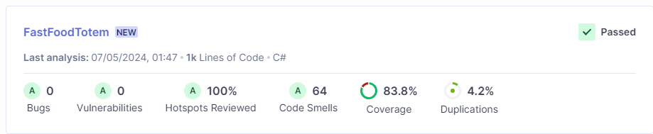
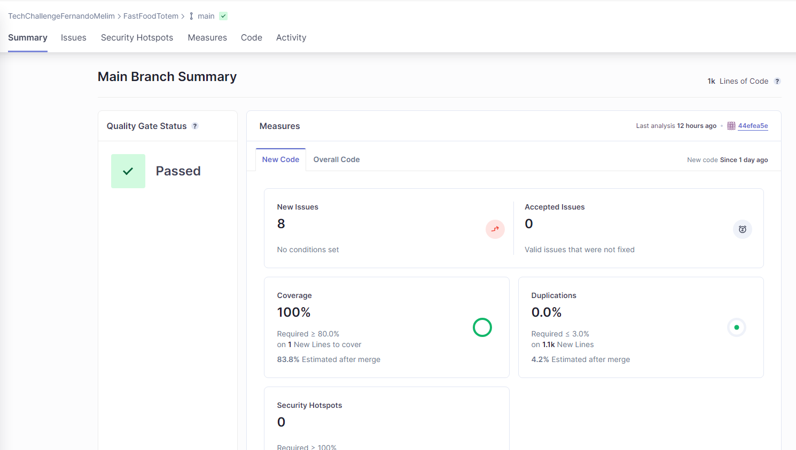

# FIAP: Pós Tech - Software Architecture

## Objetivo do projeto
Este projeto foi realizado como parte de um entregável para o curso 'Pós Tech - Software Architecture'.
O desafio proposto é realizar um projeto (MVP) monolito para atender as necessidades de um autoatendimento de um fast food.

## Pré-requisitos
* [AWS Cloud](https://aws.amazon.com/)							
	* É necessário ter uma conta na AWS para subir a infraestrutura necessária para o projeto.
* [Terraform](https://www.terraform.io/)
	* Para subir a infraesturura mantida no repositório: [Repositório Terraform](https://github.com/TechChallengeFernandoMelim/FastFoodInfra)

* [Postman](https://www.postman.com/downloads/) - Não obrigatório.

## Api

Essa API, desenvolvida no formato de Lambda Function para ser publicada na AWS, tem a finalidade de iniciar os pedidos feitos pelos clientes da lanchonete e controlar todos os produtos disponíveis para os clientes realizarem seus pedidos por parte dos funcionários da lanchonete.

## Variáveis de ambiente
Todas as variáveis de ambiente do projeto visam fazer integração com algum serviço da AWS. Explicaremos a finalidade de cada uma:

- SqlServerConnection: Conexão com base de dados do SQL Server publicada no RDS da AWS.
- PaymentServiceUrl: Url da api de pagamento que é responsável por gerar o QR code dos pedidos. API do repositório [FastFoodPayment](https://github.com/TechChallengeFernandoMelim/FastFoodPayment)
- AWS_SQS_LOG: Url da fila de log no SQS da AWS.
- AWS_SQS_GROUP_ID_LOG: Group Id da fila de log no SQS da AWS.
- AWS_ACCESS_KEY_DYNAMO: "Access key" da AWS. Recurso gerado no IAM para podermos nos conectar aos serviços da AWS;
- AWS_SECRET_KEY_DYNAMO: "Secret key" da AWS. Recurso gerado no IAM para podermos nos conectar aos serviços da AWS. Deve ser utilizado corretamente com seu par AWS_ACCESS_KEY_DYNAMO;

## Execução com Docker

A execução do projeto pode ser feita buildando o dockerfile e depois executando a imagem gerada em um container. O serviço foi testado sendo executado direto pelo visual Studio e pela AWS.

## Testes

Conforme foi solicitado, estou postando aqui as evidências de cobertura dos testes. A cobertura foi calculada via integração com o [SonarCloud](https://sonarcloud.io/) e pode ser vista nesse [link](https://sonarcloud.io/organizations/techchallengefernandomelim/projects). A integração com todos os repositórios poderá ser vista nesse link.

Através das imagens é possível observar que a cobertura por testes unitários ficou superior a 80%, conforme solicitado.
